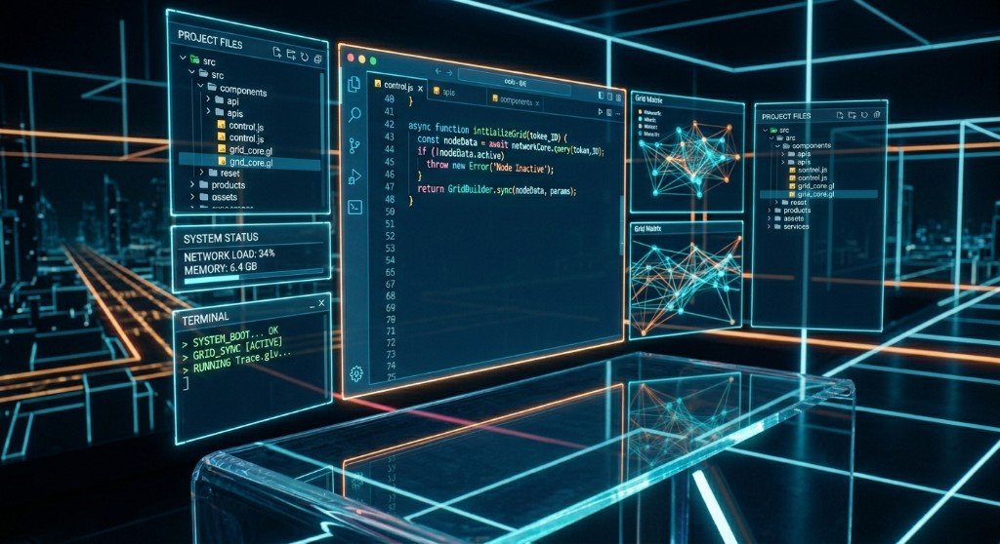

<div align="center">

# `> SYSTEM ONLINE_`

### Sci-Fi HUD Themes for Cursor & VS Code

<br>

```
 ╔══════════════════════════════════════════════════════════════╗
 ║                                                              ║
 ║   ░░░ C U R S O R   H U D   T H E M E S ░░░                ║
 ║                                                              ║
 ║   Holographic wireframe grids. Breathing neon glows.         ║
 ║   Animated gradient borders. Spinning arc reactors.          ║
 ║   Your IDE, reimagined as a sci-fi command center.           ║
 ║                                                              ║
 ╚══════════════════════════════════════════════════════════════╝
```

<br>



<br>

[](LICENSE)
[](https://cursor.com)
[](https://code.visualstudio.com)

</div>

---

## Available Themes

### 1. J.A.R.V.I.S. Techno HUD v5 — _Full Holographic_

> _"Sir, I've taken the liberty of upgrading everything."_

The flagship theme. Deep saturated navy backgrounds with a vivid multi-hue syntax palette and full holographic CSS effects.

| Feature | Detail |
|---|---|
| **Backgrounds** | Deep saturated navy (`#081428` editor, `#06122A` panels, `#040E20` bars) |
| **Syntax** | 8+ distinct hues: electric cyan, neon green, gold, vivid purple, hot pink, orange-red |
| **CSS Effects** | Wireframe grid overlay, breathing inner glows, pulsing HUD corner brackets, animated gradient tab bars, glowing borders on every panel |
| **Extras** | Spinning arc reactor SVG watermark, pulse rings, neon cursor glow, holographic command palette |
| **Extensions** | Power Mode particles, VSCode Animations, Error Lens, Material Icon Theme |

<details>
<summary><strong>Color Palette</strong></summary>

```
 Electric Cyan   #00D4FF  ████████  keywords, borders, UI accents
 Pure Cyan       #00FFFF  ████████  functions, cursor, active indicators
 Neon Green      #00FF88  ████████  strings, git added, highlights
 Gold            #FFD700  ████████  numbers, warnings, git modified
 Vivid Purple    #DA70FF  ████████  types, classes, italic markup
 Hot Pink        #FF4488  ████████  constants, self/this, language builtins
 Orange-Red      #FF6B35  ████████  decorators, git conflicts
 Alert Red       #FF3355  ████████  errors, badges, git deleted
 Sky Blue        #88DDFF  ████████  variables, parameters
 Steel Blue      #4A6A8A  ████████  comments (italic)
```

</details>

---

### 2. Neon Dragon v7 — _Dark Magenta_

> _Dragon Ball Z neon art aesthetic. Optimized for low brightness._

Deep magenta/purple backgrounds with hot pink, golden yellow, cyan, and purple syntax. Designed to be comfortable at 10% screen brightness with reading glasses.

| Feature | Detail |
|---|---|
| **Backgrounds** | Saturated dark purple (`#1C0E2C` editor, `#180C26` sidebar) |
| **Syntax** | Hot pink keywords, golden strings, bright cyan functions, purple variables |

---

### 3. J.A.R.V.I.S. HUD v3 — _Arc Reactor_

> _The research-backed JARVIS aesthetic — near-black visor, arc reactor blue dominant._

A cleaner, more minimal JARVIS look with fewer CSS effects. Good for those who want the color scheme without heavy animations.

---

## Installation

### Prerequisites

Install these extensions in Cursor (or VS Code):

| Extension | Purpose | Install |
|---|---|---|
| **Custom CSS and JS Loader** | Injects the CSS effects (glows, grids, animations) | `be5invis.vscode-custom-css` |
| **VSCode Animations** | Smooth tab, palette, and scroll transitions | `brandonkirbyson.vscode-animations` |
| **Power Mode** | Particle explosions on keystrokes | `hoovercj.vscode-power-mode` |
| **Error Lens** | Inline error/warning display with glow | `usernamehw.errorlens` |
| **Material Icon Theme** | Colored file/folder icons | `PKief.material-icon-theme` |

### Step 1 — Copy Theme Files

```bash
# Clone this repo
git clone https://github.com/mhdk1602/cursor-hud-themes.git
cd cursor-hud-themes

# Copy the CSS and SVG to your Cursor themes directory
# macOS:
mkdir -p ~/Library/Application\ Support/Cursor/User/themes
cp themes/jarvis-techno-hud-v5/hud-effects.css ~/Library/Application\ Support/Cursor/User/themes/
cp themes/jarvis-techno-hud-v5/arc-reactor.svg ~/Library/Application\ Support/Cursor/User/themes/
```

> **Windows path:** `%APPDATA%\Cursor\User\themes\`
> **Linux path:** `~/.config/Cursor/User/themes/`

### Step 2 — Update `settings.json`

Open your settings file (`Cmd+Shift+P` → "Preferences: Open User Settings (JSON)") and merge in the color settings from the theme's `theme-colors.json` file.

The key sections to add/replace:

```jsonc
{
  // 1. Base theme
  "workbench.colorTheme": "Default Dark+",

  // 2. Point the CSS loader to the effects file
  "vscode_custom_css.imports": [
    "file:///Users/YOUR_USERNAME/Library/Application%20Support/Cursor/User/themes/hud-effects.css"
  ],

  // 3. Color customizations — copy the full block from theme-colors.json
  "workbench.colorCustomizations": {
    "[Default Dark+]": {
      // ... paste from theme-colors.json ...
    }
  },

  // 4. Syntax highlighting — copy from theme-colors.json
  "editor.tokenColorCustomizations": {
    "[Default Dark+]": {
      // ... paste from theme-colors.json ...
    }
  }
}
```

> **Important:** Update the file path in `vscode_custom_css.imports` to match your actual username and OS.

### Step 3 — Update the CSS File Path

The `arc-reactor.svg` path inside `hud-effects.css` is hardcoded. Open the CSS file and find this line:

```css
background-image: url("file:///Users/haridines/Library/Application%20Support/Cursor/User/themes/arc-reactor.svg");
```

Replace `haridines` with your own username (or the full path for Windows/Linux).

### Step 4 — Enable & Reload

1. `Cmd+Shift+P` → **"Enable Custom CSS and JS"**
2. Restart Cursor when prompted
3. Dismiss the "installation appears corrupt" warning (this is expected and safe)

To apply changes after editing the CSS:
- `Cmd+Shift+P` → **"Reload Custom CSS and JS"**

### Step 5 — Configure Extensions

```jsonc
{
  // Power Mode — cyan particles on keystrokes
  "powermode.enabled": true,
  "powermode.presets": "particles",
  "powermode.shake.enabled": false,
  "powermode.maxExplosions": 8,
  "powermode.explosions.size": 6,
  "powermode.explosions.frequency": 2,
  "powermode.explosions.customCss": {
    "filter": "drop-shadow(0 0 4px rgba(0, 255, 255, 0.9)) drop-shadow(0 0 10px rgba(0, 212, 255, 0.5))"
  },

  // Animations
  "animations.Enabled": true,
  "animations.Smooth-Mode": true,

  // Material Icons — blue folders
  "workbench.iconTheme": "material-icon-theme",
  "material-icon-theme.folders.color": "#00D4FF",
  "material-icon-theme.saturation": 0.85,

  // Error Lens
  "errorLens.gutterIconsEnabled": true,
  "errorLens.messageBackgroundMode": "message"
}
```

---

## Theme Architecture

```
cursor-hud-themes/
├── README.md
├── LICENSE
├── assets/
│   └── jarvis-hud-reference.png
└── themes/
    ├── jarvis-techno-hud-v5/       # Flagship — full holographic
    │   ├── theme-colors.json       # settings.json color values
    │   ├── hud-effects.css         # CSS animations & glows
    │   └── arc-reactor.svg         # Spinning watermark
    ├── neon-dragon-magenta-v7/     # DBZ magenta aesthetic
    │   └── theme-colors.json
    └── jarvis-hud-v3/              # Minimal JARVIS blue
        └── theme-colors.json
```

---

## CSS Effects Breakdown

The `hud-effects.css` file provides these visual layers (all pure CSS, no JavaScript):

| Effect | Technique | Applied To |
|---|---|---|
| **Wireframe grid** | Layered `linear-gradient` (20px fine + 80px major) | Entire workbench background |
| **Breathing glow** | `@keyframes` animating `box-shadow` inset | Sidebar, editor, agent panel |
| **HUD corner brackets** | `::before` / `::after` pseudo-elements with pulsing borders | Sidebar, editor, terminal, agent panel |
| **Animated tab bar** | `background-size: 300%` + `background-position` animation | Active tab bottom border |
| **Panel border glow** | Layered `box-shadow` (inset edge + ambient + spread) | All panels |
| **Icon glow** | `filter: drop-shadow()` on `.codicon` | All icons |
| **Cursor pulse** | Multi-layer `box-shadow` | Editor cursor |
| **Arc reactor** | SVG with `animation: rotate` | Editor background watermark |
| **Pulse rings** | Expanding `box-shadow` keyframes | Bottom-right (reactor position) |
| **Badge flicker** | Opacity keyframes with random timing | Activity bar badges |

---

## Switching Themes

To switch between themes:

1. Replace `workbench.colorCustomizations` and `editor.tokenColorCustomizations` in `settings.json` with values from the desired theme's `theme-colors.json`
2. If the theme uses a different CSS file, update `vscode_custom_css.imports`
3. `Cmd+Shift+P` → **"Reload Custom CSS and JS"**

---

## Troubleshooting

| Problem | Solution |
|---|---|
| **"Cursor installation appears corrupt"** | Expected. Dismiss with "Don't Show Again." The CSS extension modifies internal files. |
| **No CSS effects visible** | Run `Cmd+Shift+P` → "Enable Custom CSS and JS" then restart |
| **Command palette disappears** | Quit Cursor (`Cmd+Q`) and reopen — a CSS animation may have caused a rendering conflict |
| **Arc reactor not showing** | Check the SVG path in the CSS file matches your actual file location |
| **Effects only in one panel** | Ensure you restarted Cursor after enabling/reloading Custom CSS |

---

<div align="center">

### Built by [Dinesh Hari](https://github.com/mhdk1602)

_AI Engineering Lead at BCG — building production ML systems by day, fractal IDEs by night._

<br>

```
 ┌─────────────────────────────────────────┐
 │  "The gap between 'it works' and        │
 │   'it looks like a sci-fi command        │
 │   center' is just CSS."                  │
 └─────────────────────────────────────────┘
```

<br>

**MIT License** — Free to use, modify, and share. Attribution appreciated.

</div>
